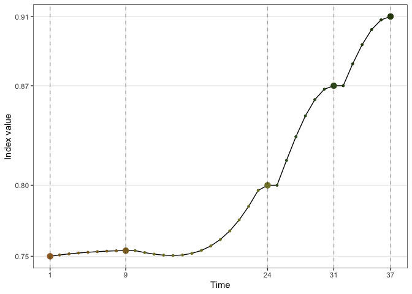
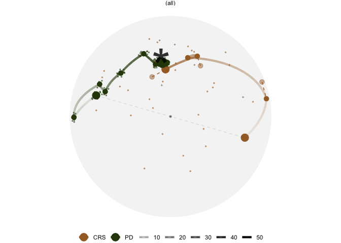

<!-- README.md is generated from README.Rmd. Please edit that file -->

# ferrn <a href='https://huizezhang-sherry.github.io/ferrn/'></a>

<!-- badges: start -->

[](https://github.com/huizezhang-sherry/ferrn/actions)
<!-- badges: end -->

The **ferrn** package extracts key components in the data object
collected by the guided tour optimisation, and produces diagnostic
plots. An associated paper can be found at
<https://journal.r-project.org/archive/2021/RJ-2021-105/index.html>.

## Installation

You can install the development version of ferrn from
[GitHub](https://github.com/) with:

``` r
# install.packages("remotes")
remotes::install_github("huizezhang-sherry/ferrn")
```

## Usage

To extract the data object from a guided tour, assign the
`annimate_xx()` function a name:

``` r
set.seed(123456)
holes_1d_better <- animate_dist(
  ferrn::boa5,
  tour_path = guided_tour(holes(), d = 1,
                          search_f =  search_better), 
  rescale = FALSE)
```

The above code will collect data from the 1D animation on `boa5`
dataset, a simulated data in the `ferrn` package.

The best projection basis found by the projection pursuit algorithm can
be extracted via

``` r
library(ferrn)
library(dplyr)
holes_1d_better %>% get_best()
#> # A tibble: 1 × 8
#>   basis         index_val info          method        alpha tries  loop    id
#>   <list>            <dbl> <chr>         <chr>         <dbl> <dbl> <dbl> <int>
#> 1 <dbl [5 × 1]>     0.914 interpolation search_better    NA     5     6    55
holes_1d_better %>% get_best() %>% pull(basis) %>% .[[1]]
#>              [,1]
#> [1,]  0.005468276
#> [2,]  0.990167039
#> [3,] -0.054198426
#> [4,]  0.088415793
#> [5,]  0.093725721
holes_1d_better %>% get_best() %>% pull(index_val)
#> [1] 0.9136095
```

Trace plot for viewing the optimisation progression with botanical
palette:

``` r
holes_1d_better %>% 
  explore_trace_interp() + 
  scale_color_continuous_botanical()
```



Compare two algorithms via plotting the projection bases on the reduced
PCA space:

``` r
bind_rows(holes_1d_geo, holes_1d_better) %>%
  bind_theoretical(matrix(c(0, 1, 0, 0, 0), nrow = 5),
                   index = tourr::holes(), raw_data = boa5) %>% 
  explore_space_pca(group = method, details = TRUE)  +
  scale_color_discrete_botanical()
```



View the projection bases on its original 5-D space via tour animation:

``` r
bind_rows(holes_1d_geo, holes_1d_better) %>%
  explore_space_tour(flip = TRUE, group = method,
                     palette = botanical_palettes$fern[c(1, 6)],
                     max_frames = 20, 
                     point_size = 2, end_size = 5)
```

<p float="center">


</p>
